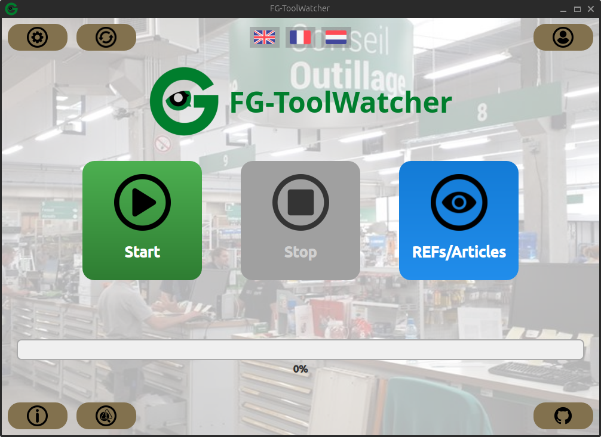

# FG-ToolWatcher

[](https://opensource.org/licenses/BSD-3-Clause)

Desktop price watcher to scrape and compare competitor hardware store prices. Built with Python and PySide6 for [**Fernand Georges**](https://www.georges.be/fr-be/).

## 📸 Screenshot


## ✨ Key Features
* **Competitor Scraping:** Scrapes product data (name, price) from multiple hardware store websites.
* **Desktop GUI:** A clean, multi-language desktop interface built with PySide6.
* **Centralized Logging:** All actions are logged to timestamped files for easy debugging (no `print()`!).
* **Automatic Update Checker:** The application checks GitHub Releases for new versions on startup.
* **Developer-Friendly:** Includes a `Makefile` for standardized setup and build processes.

## 💻 Tech Stack
* **Core:** Python 3.11+
* **GUI:** PySide6
* **Scraping:** cloudscraper, BeautifulSoup
* **Data:** Pandas
* **Packaging:** PyInstaller

---

## 🚀 Getting Started (for Developers)
To set up the development environment:

1.  **Clone the repository:**
    ```bash
    git clone [https://github.com/jejeAKAgg/FG-ToolWatcher.git](https://github.com/jejeAKAgg/FG-ToolWatcher.git)
    cd FG-ToolWatcher
    ```

2.  **Create the environment and install dependencies:**
    (This uses the `Makefile` to create the virtual environment and install `requirements.txt`)
    ```bash
    make setup
    ```

3.  **Run the application:**
    * **Standard Mode:**
        ```bash
        make run
        ```
    * **Debug Mode (Verbose):**
        ```bash
        python Launcher.py --debug
        ```

## 📦 Installation (for Users)
1.  Go to the [**Releases Page**](https://github.com/jejeAKAgg/FG-ToolWatcher/releases) of this repository.
2.  Download the `.zip` file from the latest release (e.g., `FG-ToolWatcher-v1.0.0.zip`).
3.  Unzip the folder to a permanent location (like your Desktop or "My Documents").
4.  Open the folder and double-click `Launcher.exe` to start the application.

---

## 🤝 Contributing
Contributions from the Fernand Georges IT team are welcome!

To ensure consistency and maintainability, please read our **[CONTRIBUTING.md](CONTRIBUTING.md)** file *before* you start working. It contains our complete workflow, code standards, and commit conventions.

## 📜 License
This project is licensed under the BSD-3-Clause License. See the [LICENSE](LICENSE) file for details.